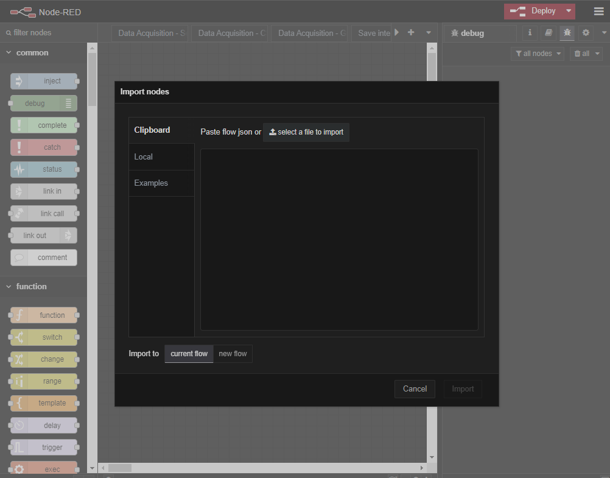
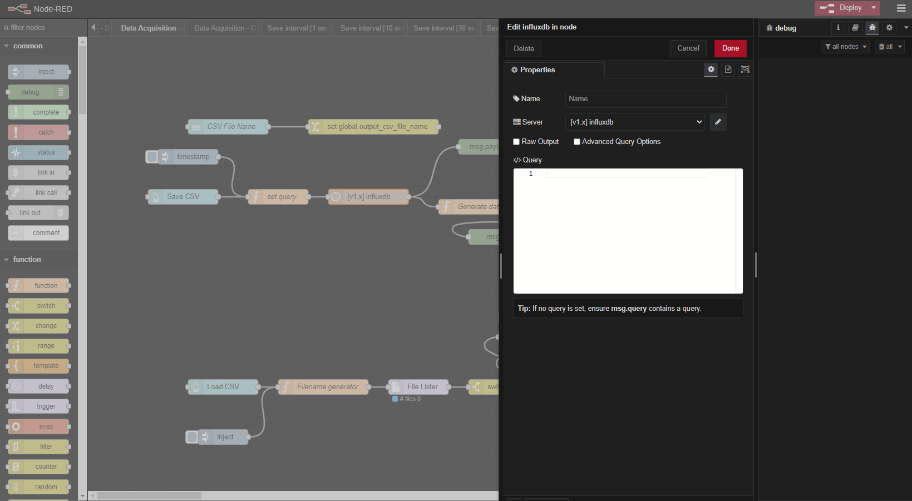
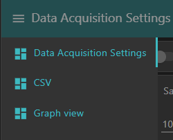

# Data Acquisition Dashboard 

This is a data acquisition dashboard example created in Node-RED with Sequent Microsystems [Sixteen Analog/Digital Inputs 8-Layer Stackable HAT for Raspberry Pi](https://sequentmicrosystems.com/products/sixteen-analog-digital-inputs-8-layer-stackable-hat-for-raspberry-pi?variant=44857261523196)

## I) Initial setup
### 1) Node-RED
* Install NodeRed with the following command:
```bash
bash <(curl -sL https://raw.githubusercontent.com/node-red/linux-installers/master/deb/update-nodejs-and-nodered)
```

* If you want Node-RED to run when the Pi is turned on, or re-booted, you can enable the service to autostart by running the command:
```bash
sudo systemctl enable nodered.service
```

* To disable the service, run the command:
```bash
sudo systemctl disable nodered.service
```

* Connect up to 8 [Sixteen Analog/Digital Inputs Cards](https://sequentmicrosystems.com/products/sixteen-analog-digital-inputs-8-layer-stackable-hat-for-raspberry-pi?variant=44857261523196) to your raspberry, each with different stack level jumper settings.  

* Install the necessary nodes by opening the Node-RED interface in a browser: Go to Menu > Manage pallete > Install and search for the following nodes:
```bash
node-red-contrib-fs
node-red-dashboard
node-red-node-ui-table
node-red-contrib-influxdb

```


### 2) InfluxDB
* Install InfluxDB using the following commands:
```bash
sudo apt update
sudo apt upgrade
curl https://repos.influxdata.com/influxdata-archive.key | gpg --dearmor | sudo tee /usr/share/keyrings/influxdb-archive-keyring.gpg >/dev/null
echo "deb [signed-by=/usr/share/keyrings/influxdb-archive-keyring.gpg] https://repos.influxdata.com/debian stable main" | sudo tee /etc/apt/sources.list.d/influxdb.list
sudo apt update
sudo apt install influxdb
sudo systemctl unmask influxdb
sudo systemctl enable influxdb
sudo systemctl start influxdb
```

* Enter inside the InfluxDB server using the following command:
```bash
influx
```

* Create the database inside the InfluxDB server using the following command:
```bash
> create database database_influx
```

### 3) Grafana

* Install docker on your Raspberry Pi using the following commands:
```bash
curl -fsSL https://get.docker.com -o get-docker.sh
sudo sh get-docker.sh
sudo usermod -aG docker pi
sudo apt install -y libffi-dev libssl-dev python3 python3-pip
```

* You can verify if Docker was installed correctly:
```bash
docker --version
```

* Create a Grafana docker container using the following command:
```bash
docker run -d --name=grafana -p 3000:3000 grafana/grafana-enterprise:10.4.0-ubuntu
```

* You can check if the container was successfully created:
```docker ps``` or ```docker container ls```

## II) Importing and configuring the Node-RED flow

* Import the Data Acquisition Dashboard flow: Go to Menu > Import > select a file to import. Load the provided [flows.json](https://github.com/SequentMicrosystems/16univin-rpi/blob/main/node-red/DataAquisitionDashboard/flows.json) file and click the Import button.




* Click on the top right ```Deploy``` red button.

* Configure the InfluxDB server inside Node-RED with the IP address of your Raspberry Pi and port ```8086``` then click again the ```Deploy``` red button. You can find all the database related nodes using ```CTRL+F```. Just choose one and double-click it.


* Click the ```Edit``` button for the database server.



* Configure here the IP address of your Raspberry Pi then click ```Update```.


## III) Dashboard functionality
* There are 3 pages: ```Data Acquisition Settings```, ```CSV``` and ```Graph/Table view```. The pages menu can be found at the top left corner of the dashboard, near the page title:

<p align="center">
  
</p>

### 1) The home page of the dashboard, "Data Acquisition Settings"


* ```Master ON/OFF``` toggle ==> turns on/off the global functionality of the dashboard.
* ```Stack level``` dropdown menu ==> here we can select the stack level of the board we want to configure. Default value: ```0```.
* ```Input``` column ==> this column shows the inputs that can be configured and a toggle for each input to turn on/off the data acquisition process.
* ```Save interval``` column ==> in this column we can configure the time interval between measurements for each input. Options: ```1 sec```, ```10 sec```, ```30 sec```, ```1 min```, ```10 min```, ```30 min```, ```1 hour```. Default value: ```10 sec```.

<p align="center">
  
</p>

* ```Config``` column ==> in this column we can select the type of configuration for each input. Options: ```1K thermistors```, ```10K thermistors```, ```0-10V```.

<p align="center">
  
</p>

* ```Measurement``` column ==> in this column we can write for each input a label of what is actually measured (e.g. ```Temperature```, ```Pressure```, ```Voltage``` etc.)
* ```Unit``` column ==> in this column we write the unit of measurement (e.g. ```C```, ```F```, ```K```, ```Pa```, ```V``` etc.). The default value (```C``` or ```V```) is automatically written when a certain type of config from the ```Config``` column is selected.
* ```Parameters``` column ==> in this column we write the needed parameters to convert resistance to temperature or voltage to any other unit. The default parameters are automatically written when a certain type of config from the ```Config``` column is selected.
* ```SAVE SETUP``` button ==> when the whole setup is complete, we can save it so that it can be automatically loaded if something goes wrong with the Raspberry Pi (e.g. power loss). A file named ```global_settings.json``` is generated in ```/home/pi``` location.

### Valid input configuration

* In order to measure something correctly with this dashboard, we need to configure correctly the inputs we want to use.
* Firstly, we select the ```Stack level```, then we choose the type of ```Config``` for the input, then we take a look at the ```Unit``` and the ```Parameters``` if the default values are there. If we want to change them we can do that.
* Examples of valid configurations for ```Input 1``` (default values for ```Unit``` and ```Parameters```):


* Then we write the ```Measurement``` label (optional step), select whatever ```Save Interval``` we want (or let it default at ```10 sec```), turn ```Master``` toggle on and then turn the ```Input``` toggle on for the input we previously configured (in our example case, ```Input 1```).


* If all needed ```Parameters``` or the ```Unit``` are not configured for the selected ```Config``` type, the dashboard will throw a notification error ```Input X: Configuration incomplete!```
* Example for ```Input 1``` where ```Unit``` is not configured/deleted:


* Mandatory parameters for ```1K/10K thermistors```: ```Unit``` (```C```, ```F``` or ```K```) and ```Parameter``` ```B```. Optional: ```Measurement``` label (needed only for ```Graph view```).
* Mandatory parameters for ```0-10V```: ```Unit``` (whatever the user wants to measure, e.g. ```V```, ```Pa``` etc.) and ```Parameters``` ```0V``` and ```10V```. Optional: ```Measurement``` label (needed only for ```Graph view```).

* If the ```16univin``` is not installed on the Raspberry Pi, the dashboard will throw a notification error ```Input X: Command not found!```.
* If the selected ```Stack level``` is not the one configured on the board, the dashboard will throw a notification error ```Input X: Command failed!```
* If the ```influxdb``` database or the ```influxdb``` nodes are not configured properly, the dashboard will throw a notification error ```Database not available!```.

### 2) The "CSV" page


* In this page we can generate a CSV file which will contain all the measurements from the influxdb database.
* Firstly, we write a name for the ```.csv``` file, then press the ```SAVE CSV``` button to generate it. 
* The file is generated in ```/home/pi``` location.
* If we want to load the ```.csv``` file to see it in the dashboard, we make sure that the file name is written and then press the ```LOAD CSV``` button to show the contents of the file in the dashboard.


* If file name is not defined and we press ```SAVE CSV```, the dashboard will throw a notification error ```Filename not defined!```.
* If file name is defined but the file with that name does not exist, the dashboard will throw a notification error ```CSV file does not exist!```.
* Also, if the ```influxdb``` database or the ```influxdb``` nodes are not configured properly, the dashboard will throw a notification error ```Database not available!```.

### 3) The "Graph/Table view" page
* In this page we can view the data in a form of a graph or a table.


* ```Select Input``` dropdown menu ==> here we can select what input we want to show its measurements in a graph/table. Visible in both ```Graph view``` and ```Table view```.


* ```Time Scale``` dropdown menu ==> here we can select the time scale we want to show for the selected input in the graph. Visible only in ```Graph view```.


* ```Select View``` dropdown menu ==> here we switch between ```Graph view``` and ```Table view```. Default selection: ```Graph view```.

* Example graph view for ```Input 1```, time scale of ```12 months```:


* In ```Table view``` we select only the input we want to show in the table. It will show all the input data in cronological order with the newest value at the top of the table.

* Example table view for ```Input 1```, same time scale of ```12 months```:


* The graph/table will automatically update when a new measurement is done for the selected ```Input```. The time between measurements is defined by the ```Save Interval```, configured in ```Data Acquisition Settings``` page.

* In ```Graph view``` it is possible to receive a notification ```No data to plot!``` for the selected ```Time Scale```. This is because actually there is no data for the selected ```Time Scale``` to plot. If we select a larger ```Time Scale``` we may be able to plot some data for the selected ```Input```.
* Similar for ```Table view```, it is possible to receive a notification ```No data to display!``` for the selected ```Input```. This is because actually there is no input data for the selected ```Input```. Select another ```Input``` to display its data in table form.

* In ```Graph view```, if ```Measurement``` label or ```Unit``` are not defined for the selected ```Input``` the dashboard will throw a notification error ```Graph view: Measure or Unit not defined!```.
* Also, if the ```influxdb``` database or the ```influxdb``` nodes are not configured properly, the dashboard will throw a notification error in both views ```Database not available!```.

## IV) Integration with Grafana
* TODO
